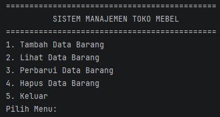
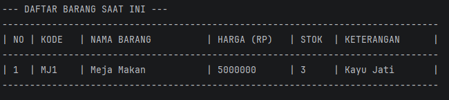
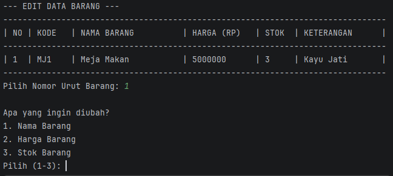
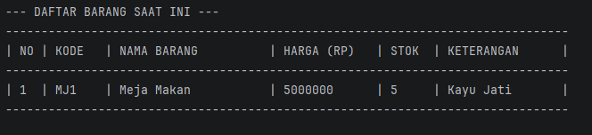
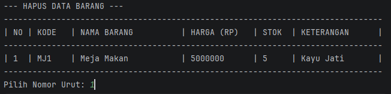
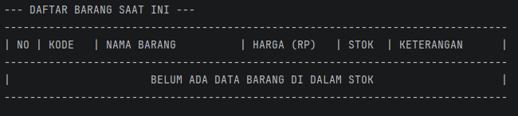

# Sistem Manajemen Toko Mebel

Sistem ini dibuat agar memudahkan para pengguna untuk mengontrol inventaris dari toko mebel.

### File yang tersedia:
| Nama File  | Fungsi                                    |
|------------|-------------------------------------------|
| Mebel.java | Digunakan untuk menyimpan data umum mebel | 
| Kursi.java | Digunakan untuk menyimpan data kursi      | 
| Meja.java  | Digunakan untuk menyimpan data meja       | 
| Main.java  | Mengatur keseluruhan alur program         | 
| 
## Class dan Properti:
### 1. Mebel.java:
| Properti  | Tipe Data | Keterangan                               |
|----------|-----------|------------------------------------------|
| kode     | String    | Kode unik untuk menandakan sebuah barang |
| nama     | String    | Untuk menyimpan nama barang              |
| harga    | double    | Untuk menyimpan harga barang             |
| stok     | int       | Untuk menyimpan jumlah stok              |
### 2. Meja.java:
| Properti | Tipe Data  | Keterangan                                                                 |
|---------|------------|----------------------------------------------------------------------------|
| bahan   | String     | Digunakan untuk menyimpan bahan dari meja tersebut seperti kayu atau besi. |
| counter | static int | digunakan untuk menyimpan nomor urut atau kode unik dari barang, fungsi utamanya agar kode unik dapat dilakukan secara incremental                                                                     |
### 3. Kursi.java:
| Properti | Tipe Data  | Keterangan                                                                                                                         |
|---------|------------|------------------------------------------------------------------------------------------------------------------------------------|
| tipe    | String     | Digunakan untuk menyimpan tipe dari meja tersebut seperti minimalis atau kantor.                                                   |
| counter | static int | digunakan untuk menyimpan nomor urut atau kode unik dari barang, fungsi utamanya agar kode unik dapat dilakukan secara incremental |

## Fitur Utama Program:
Dapat mengelola (menambah, melihat, mengubah, dan menghapus) barang-barang/mebel yang tersedia.

## Output Program:

#### Ini adakah tampilan awal program. Disini, menawarkan 4 opsi utama sesuai dengan fitur program ini.

#

#### Ini adalah output jika kita memilih opsi 1, yang dimana user atau pengguna akan disuruh untuk memasukkan nama barang, harga jual, jumlah stok, dan bahan utama barang tersebut.

# 

#### Ini adalah output jika kita memilih opsi 2, yang dimana user akan ditampilkan daftar barang yang telah ada.

#

#### Ini adalah output jika kita memilih opsi 3, yang dimana user akan diminta untuk memilih nomor urut barang yang digunakna sebagai indeks, lalu setelah memilih nomor urut barang, user akan ditawarkan 3 opsi untuk mengubah  nama barang, harga barang, atau stok barang.

#

#### Tampilan ini merupakan setelah user mengubah stok barang yang sebelumnya 3 menjadi 5.

#

 #### Ini adalah output jika kita memilih opsi 4, yang dimana user atau pengguna akan diminta memasukkan nomor urut barang yang ingin dihapus.

#

#### Tampilan ini adalah output ketika user atau pengguna sudah menghapus barang sesuai nomor urut barang yang diminta tadi, list barang nya akan menjadi kosong.

