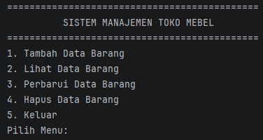
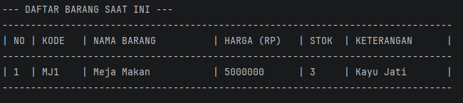
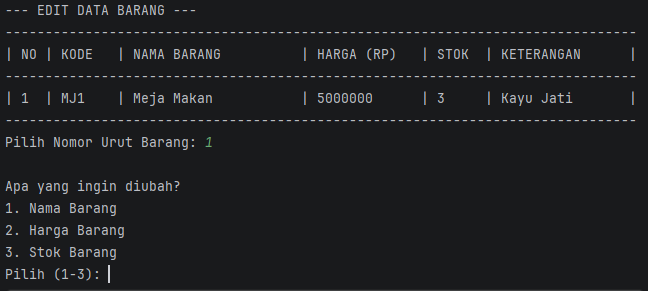
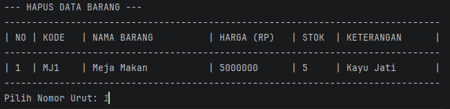
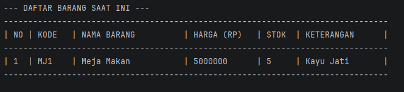
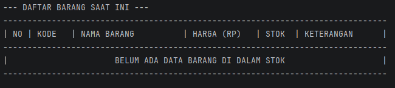

# Sistem Manajemen Toko Mebel

Sistem ini dibuat agar memudahkan para pengguna untuk mengontrol inventaris dari toko mebel.

### File yang tersedia:
| Nama File      | Fungsi                                         |
|----------------|------------------------------------------------|
| Mebel.java     | Abstract class utama yang menyimpan data umum mebel |
| Kursi.java     | Subclass untuk menyimpan data kursi            |
| Meja.java      | Subclass untuk menyimpan data meja             |
| Lemari.java    | Subclass untuk menyimpan data lemari           |
| Perawatan.java | Interface yang mendefinisikan kontrak perawatan barang |
| Main.java      | Mengatur keseluruhan alur program              |

## Konsep OOP yang Diterapkan

### Abstract Class
`Mebel.java` merupakan **abstract class** yang berfungsi sebagai class induk (parent class) dari seluruh jenis barang mebel. Karena bersifat abstrak, class ini tidak dapat dibuat objeknya secara langsung — melainkan hanya bisa digunakan melalui subclass turunannya (`Meja`, `Kursi`, `Lemari`).

Abstract method yang didefinisikan di dalam `Mebel`:
```java
public abstract double hitungDiskon();
```
Setiap subclass **wajib** mengimplementasikan method ini dengan logika diskon masing-masing.

### Interface
`Perawatan.java` adalah sebuah **interface** yang bertindak sebagai kontrak, memastikan setiap class yang mengimplementasikannya memiliki kemampuan memberikan informasi perawatan barang.

```java
public interface Perawatan {
    void caraPerawatan();
    boolean butuhPerakitan();
}
```

Interface ini diimplementasikan oleh ketiga subclass (`Meja`, `Kursi`, `Lemari`) menggunakan keyword `implements`:
```java
public class Meja extends Mebel implements Perawatan { ... }
```

### Method Overriding
Setiap subclass meng-override `hitungDiskon()` dengan persentase berbeda:
| Kelas  | Diskon |
|--------|--------|
| Meja   | 5%     |
| Kursi  | 10%    |
| Lemari | 7%     |

### Method Overloading
Class `Mebel` memiliki dua versi `hitungTotal()`:
- `hitungTotal(int jumlahBeli)` — tanpa diskon
- `hitungTotal(int jumlahBeli, double diskonTambahan)` — dengan diskon

---

## Class dan Properti

### 1. Mebel.java (Abstract Class):
| Atribut | Tipe Data | Keterangan                               |
|---------|-----------|------------------------------------------|
| kode    | String    | Kode unik untuk menandakan sebuah barang |
| nama    | String    | Untuk menyimpan nama barang              |
| harga   | double    | Untuk menyimpan harga barang             |
| stok    | int       | Untuk menyimpan jumlah stok              |

**Abstract Method:**
| Method          | Return Type | Keterangan                                      |
|-----------------|-------------|-------------------------------------------------|
| hitungDiskon()  | double      | Wajib di-override oleh setiap subclass          |

**Concrete Method:**
| Method                                    | Return Type | Keterangan                          |
|-------------------------------------------|-------------|-------------------------------------|
| hitungTotal(int jumlahBeli)               | double      | Hitung total tanpa diskon           |
| hitungTotal(int jumlahBeli, double diskon)| double      | Hitung total dengan diskon (overload) |

### 2. Meja.java:
| Atribut | Tipe Data  | Keterangan                                                                 |
|---------|------------|----------------------------------------------------------------------------|
| bahan   | String     | Digunakan untuk menyimpan bahan dari meja tersebut seperti kayu atau besi. |
| counter | static int | Digunakan untuk menyimpan nomor urut atau kode unik dari barang, fungsi utamanya agar kode unik dapat dilakukan secara incremental |

**Implementasi Interface Perawatan:**
| Method           | Return       | Isi                                                         |
|------------------|--------------|-------------------------------------------------------------|
| caraPerawatan()  | void         | Lap meja menggunakan cairan pembersih kayu secara berkala   |
| butuhPerakitan() | boolean      | `true` — meja perlu dirakit                                 |

### 3. Kursi.java:
| Atribut | Tipe Data  | Keterangan                                                                                                                         |
|---------|------------|------------------------------------------------------------------------------------------------------------------------------------|
| tipe    | String     | Digunakan untuk menyimpan tipe dari kursi tersebut seperti minimalis atau kantor.                                                  |
| counter | static int | Digunakan untuk menyimpan nomor urut atau kode unik dari barang, fungsi utamanya agar kode unik dapat dilakukan secara incremental |

**Implementasi Interface Perawatan:**
| Method           | Return  | Isi                                                                    |
|------------------|---------|------------------------------------------------------------------------|
| caraPerawatan()  | void    | Hindari kursi dari paparan sinar matahari langsung agar warna tidak pudar |
| butuhPerakitan() | boolean | `false` — kursi dikirim utuh, tidak perlu dirakit                      |

### 4. Lemari.java:
| Atribut    | Tipe Data  | Keterangan                                                                                                                         |
|------------|------------|------------------------------------------------------------------------------------------------------------------------------------|
| jenisPintu | String     | Digunakan untuk menyimpan jenis pintu lemari, seperti pintu geser atau pintu engsel.                                              |
| counter    | static int | Digunakan untuk menyimpan nomor urut atau kode unik dari barang, fungsi utamanya agar kode unik dapat dilakukan secara incremental |

**Implementasi Interface Perawatan:**
| Method           | Return  | Isi                                                                 |
|------------------|---------|---------------------------------------------------------------------|
| caraPerawatan()  | void    | Berikan kamper di dalam lemari untuk mencegah kelembaban dan jamur  |
| butuhPerakitan() | boolean | `true` — lemari perlu dirakit                                       |

### 5. Perawatan.java (Interface):
| Method           | Return Type | Keterangan                                              |
|------------------|-------------|---------------------------------------------------------|
| caraPerawatan()  | void        | Menampilkan cara merawat barang sesuai jenisnya         |
| butuhPerakitan() | boolean     | Mengembalikan `true` jika barang perlu dirakit sendiri  |

---

## Fitur Utama Program:
Dapat mengelola (menambah, melihat, mensimulasikan pembelian, mengubah, dan menghapus) barang-barang/mebel yang tersedia.

---

## Output Program:


#### Ini adalah tampilan awal program. Disini, menawarkan 6 opsi utama sesuai dengan fitur program ini.

#


#### Ini adalah output jika kita memilih opsi 1, yang dimana user atau pengguna akan disuruh untuk memilih kategori barang (Meja/Kursi/Lemari), lalu memasukkan nama barang, harga jual, jumlah stok, dan keterangan spesifik sesuai kategori.

# 



#### Ini adalah output jika kita memilih opsi 2, yang dimana user akan ditampilkan daftar barang yang telah ada beserta tabel informasi diskon per kategori.

#



#### Ini adalah output jika kita memilih opsi 3 (Simulasi Pembelian), yang dimana user akan diminta memilih barang dan memasukkan jumlah beli. Program menampilkan total harga tanpa dan dengan diskon, jumlah penghematan, serta informasi perawatan dan status perakitan barang.

#



#### Ini adalah output jika kita memilih opsi 4 (Perbarui Data Barang), yang dimana user akan diminta untuk memilih nomor urut barang yang digunakan sebagai indeks, lalu setelah memilih nomor urut barang, user akan ditawarkan 3 opsi untuk mengubah nama barang, harga barang, atau stok barang.

#



#### Tampilan ini merupakan setelah user mengubah stok barang yang sebelumnya 3 menjadi 5.

#


#### Ini adalah output jika kita memilih opsi 5 (Hapus Data Barang), yang dimana user atau pengguna akan diminta memasukkan nomor urut barang yang ingin dihapus.

#



#### Tampilan ini adalah output ketika user atau pengguna sudah menghapus barang sesuai nomor urut barang yang diminta tadi, list barang nya akan menjadi kosong.

---

# Tampilan Menu Utama
Menampilkan 6 pilihan menu utama program.

## Opsi 1 — Tambah Data Barang
User diminta memasukkan kategori barang (Meja/Kursi/Lemari), nama, harga, stok, dan keterangan spesifik sesuai kategori (bahan utama untuk Meja, tipe/model untuk Kursi, jenis pintu untuk Lemari).

## Opsi 2 — Lihat Data Barang
Menampilkan dua tabel:

- Tabel inventaris lengkap semua barang
- Tabel informasi diskon per barang (hasil Overriding `hitungDiskon()`, di mana Meja diskon 5%, Kursi 10%, Lemari 7%)

## Opsi 3 — Simulasi Pembelian
User memilih barang dan memasukkan jumlah beli. Program menampilkan:

- Total harga tanpa diskon → menggunakan `hitungTotal(jumlah)` (Overloading 1)
- Total harga dengan diskon → menggunakan `hitungTotal(jumlah, persenDiskon)` (Overloading 2)
- Jumlah penghematan yang didapat
- Info perawatan dari interface `Perawatan`: cara merawat barang (`caraPerawatan()`) dan status perakitan (`butuhPerakitan()`)

## Opsi 4 — Perbarui Data Barang
User memilih nomor urut barang lalu memilih atribut yang ingin diubah: nama, harga, atau stok.

## Opsi 5 — Hapus Data Barang
User memasukkan nomor urut barang yang ingin dihapus dari daftar inventaris.

## Opsi 6 — Keluar
Mengakhiri program dan menutup Scanner.
